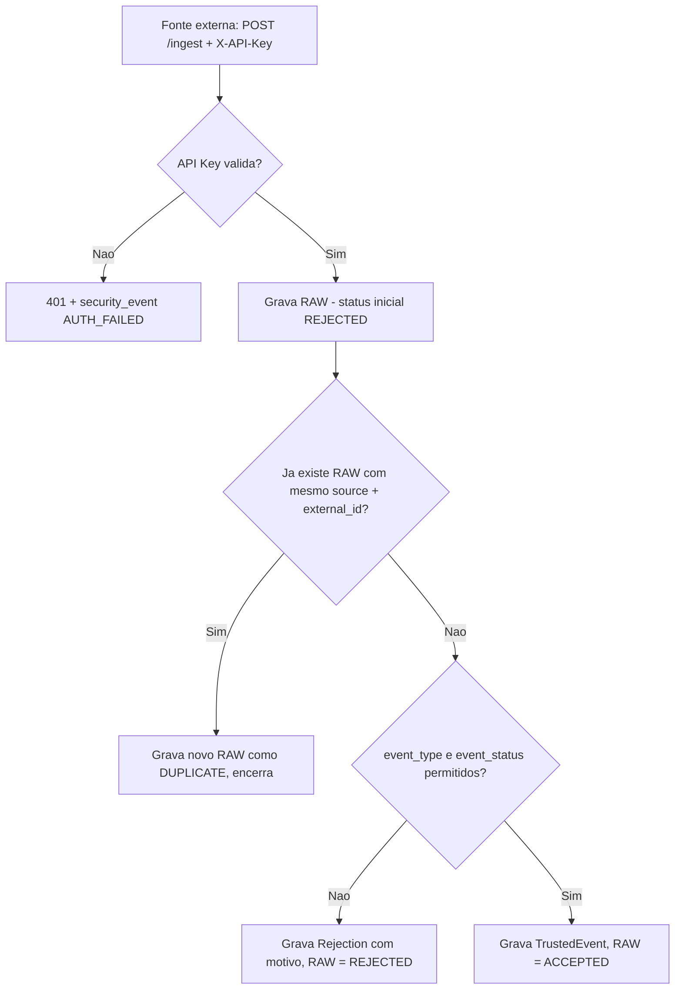

# Data Pipeline API — RAW → TRUSTED → REJECTIONS

API para ingestão de eventos de múltiplas fontes, com validação, deduplicação, persistência relacional, rastreio de rejeições, autenticação em duas camadas (fontes via API Key, usuários via JWT), RBAC, auditoria e observabilidade básica.

**Status:** MVP em produção, com pipeline de ingestão, autenticação/RBAC, auditoria e suíte de testes automatizados funcionando. Alguns pontos de configuração de segurança e deduplicação têm lacunas reais — detalhados em "Trade-offs" e "Limitações".

**Ambiente publicado (Render):**
- API: `https://data-pipeline-api-p01y.onrender.com`
- Frontend: `https://data-pipeline-frontend.onrender.com`
- Healthcheck: `https://data-pipeline-api-p01y.onrender.com/api/v1/health`

---

## Problema Resolvido

Quando várias fontes (parceiros, sistemas internos, sensores) mandam eventos pra um mesmo lugar, o problema raramente é só "salvar o dado". É saber o que fazer quando o evento vem malformado, quando ele repete, e quem mexeu no quê depois.

Este projeto resolve isso com um pipeline de três estágios: todo evento entra como **RAW** (sempre gravado, mesmo que depois seja recusado), é validado e vira **TRUSTED** (dado confiável, consultável) ou **REJECTION** (com motivo e o payload original preservado). Por cima disso, autenticação por fonte, login com perfis de acesso e auditoria de qualquer alteração manual nos dados.

---

## Como Funciona



Do outro lado, operadores/analistas/auditores consultam TRUSTED, REJECTIONS, auditoria e eventos de segurança via um front-end administrativo, autenticados por JWT e restritos por papel.

---

## Arquitetura

- **`app/main.py`** — bootstrap da aplicação: registra middlewares (rate limit, security headers, request id, CORS), os handlers de erro e o router principal.
- **`app/api/router.py` + `app/api/routes/`** — uma rota por módulo (`auth`, `ingest`, `trusted`, `rejections`, `audit`, `security_events`, `metrics`, `health`, `ready`). Cada rota só orquestra: valida entrada, chama a camada de baixo, formata a saída.
- **`app/api/deps.py`** — as duas formas de autenticação (API Key por fonte, JWT por usuário) e o RBAC (`require_roles`), usados como dependências do FastAPI.
- **`app/domain/validation.py`** — a única regra de negócio hoje: `event_type` e `event_status` precisam estar em listas fechadas de valores permitidos.
- **`app/services/ingest_service.py`** — orquestra o pipeline inteiro: grava RAW, checa duplicidade, valida, decide entre TRUSTED e REJECTION.
- **`app/infra/db/`** — `models` (SQLAlchemy), `repositories` (uma função por operação de acesso a dado, sem lógica de negócio) e `migrations` (Alembic).
- **`app/core/`** — configuração (`settings.py`), segurança (`security.py`), logging estruturado, rate limit, bloqueio de brute-force, métricas HTTP em memória e os middlewares de request-id/security-headers.
- **`app/scripts/seed.py`** — cria o usuário admin e a fonte iniciais, de forma idempotente.
- **`frontend/`** — painel administrativo estático (HTML/CSS/JS puro), com login e telas de consulta.

---

## Segurança

O projeto tem duas identidades diferentes convivendo na mesma API:

- **Fontes de dados** autenticam no `/ingest` com uma API Key (header `X-API-Key`), comparada via hash SHA-256 (`hmac.compare_digest`, pra evitar timing attack) contra o hash salvo no banco — a chave em texto puro nunca é persistida.
- **Usuários humanos** autenticam via `POST /auth/login` (usuário/senha) e recebem um `access_token` curto e um `refresh_token` longo; `POST /auth/refresh` troca o refresh por um novo access token.
- **RBAC** com quatro papéis (`admin`, `analyst`, `operator`, `auditor`), aplicado por rota:

| Rota | Papéis permitidos |
|---|---|
| `GET /trusted` | operator, analyst, admin |
| `PATCH /trusted/{id}` | admin |
| `GET /rejections` | analyst, admin |
| `GET /audit` | auditor, admin |
| `GET /security-events` | auditor, admin |
| `GET /metrics` | operator, analyst, admin |

- **Rate limiting** (SlowAPI) no login, configurável via `LOGIN_RATE_LIMIT`, e **bloqueio por tentativas** (5 falhas seguidas → bloqueio de 10 minutos por IP).
- **Auditoria**: qualquer `PATCH` em `/trusted` exige um campo `reason` e grava um snapshot de antes/depois.
- **Security events**: tentativas de autenticação inválidas e acessos negados geram um registro próprio, separado da auditoria de dados — pensado pra investigação, não pra rastreio de mudança.

---

## Observabilidade

- **`X-Request-Id`** — aceita o valor enviado pelo cliente ou gera um novo; fica disponível em todo o ciclo da requisição e volta no header da resposta, junto com `X-Process-Time-Ms`.
- **Logging estruturado** (`app/core/logging.py`) com `request_id`, `client_ip`, `user_id` e `role` em cada linha, pra correlacionar log com requisição.
- **`GET /metrics`** — combina agregados do banco (contagem por status, top fontes) com um snapshot de contadores HTTP em memória (total de requests, 4xx, 5xx, uptime, latência média por rota).
- **`GET /health`** e **`GET /ready`** — o segundo faz um `SELECT 1` real no banco e devolve 503 se o Postgres estiver fora do ar, pensado pra orquestrador/load balancer.

---

## Decisões de Arquitetura

**RAW sempre gravado primeiro, com status pessimista.** Todo evento que chega vira uma linha em `raw_ingestion` antes de qualquer validação, já marcado como `REJECTED` por padrão. Garante que nenhum dado bruto se perde, mesmo que a validação falhe logo depois.

**Deduplicação simples por `(source, external_id)`.** Decisão consciente de simplicidade pra esta fase — o efeito colateral está detalhado nos trade-offs.

**Hash de API Key com SHA-256 + `hmac.compare_digest`**, e não bcrypt/argon2: como a chave é gerada com alta entropia (`secrets.token_urlsafe(32)`), um hash rápido e comparado em tempo constante já é suficiente; reservei bcrypt/passlib pra senha de usuário, que tem entropia bem menor.

**Dois tokens (access curto + refresh longo).** Evita forçar login a cada hora sem manter a sessão indefinidamente válida.

**Chave de rate-limit/brute-force configurável via header `X-Client-IP`.** Pensado originalmente pra facilitar testes automatizados e simular estar atrás de um proxy sem precisar simular conexões TCP reais. O custo dessa flexibilidade está nos trade-offs.

**Bootstrap via script (`seed.py`), não via endpoint.** Como não existe tela de "criar admin", o primeiro usuário e a primeira fonte nascem de um script idempotente, disparado automaticamente no `CMD` do Dockerfile a cada subida do container.

**Nginx com bloco HTTPS comentado.** Preferi deixar pronto pra ativar quando houver domínio e certificado, em vez de forçar HTTPS num ambiente que ainda não tem os dois.

---

## Trade-offs

**`payload_hash` é calculado, mas não decide a deduplicação.** O hash do payload é salvo em todo `RawIngestion`, mas a checagem de duplicidade hoje olha só pra `(source_id, external_id)`. Se a mesma fonte reenviar o mesmo `external_id` com dados diferentes — por exemplo, uma atualização legítima do mesmo evento — o sistema trata como `DUPLICATE` e descarta, sem gerar um novo `TRUSTED`. O hash existe, mas não cumpre ainda o papel que o nome sugere.

**Estado operacional em memória do processo.** Os contadores usados em `/metrics` (`app/core/http_metrics.py`) e o bloqueio de brute-force (`app/core/login_attempts.py`) vivem em dicionários dentro do processo Python, protegidos por lock. Funciona bem com uma única réplica; com múltiplos workers ou instâncias, cada processo tem sua própria contagem — um atacante distribuído entre processos nunca acumula tentativas no mesmo contador, e `/metrics` só reflete o processo que atendeu aquela chamada específica.

**Identificação de IP inconsistente entre módulos, e desalinhada com o Nginx do próprio repositório.** A ingestão usa `request.client.host` puro. Login e rate-limit aceitam um header `X-Client-IP` enviado pelo cliente, documentado como recurso pra testes/proxy. O `nginx/default.conf` deste projeto, porém, define `X-Real-IP` e `X-Forwarded-For` — nunca `X-Client-IP`. Ou seja, atrás do Nginx documentado aqui, esse header nunca é preenchido pelo proxy e fica sob controle total de quem faz a chamada.

**`SEED_ON_STARTUP` não é lido em nenhum lugar.** A variável existe em `settings.py`, mas quem decide se o seed roda é o `CMD` do Dockerfile, que chama `python -m app.scripts.seed` incondicionalmente a cada subida. Na prática, isso significa que a senha do admin seed e a API Key da fonte seed voltam pro valor do `.env` a cada restart do container, mesmo que alguém tenha alterado esses valores direto no banco depois.

---

## Estrutura do Projeto

```text
data_pipeline_api/
├── Dockerfile
├── docker-compose.yml
├── docker-compose.prod.yml
├── alembic.ini
├── requirements.txt
├── .env.example / .env.prod.example
├── app/
│   ├── main.py
│   ├── api/
│   │   ├── router.py
│   │   ├── deps.py                 # API Key, JWT, RBAC
│   │   ├── routes/                  # auth, ingest, trusted, rejections, audit, security_events, metrics, health, ready
│   │   └── schemas/                 # DTOs Pydantic por módulo
│   ├── domain/
│   │   └── validation.py            # regra de negócio: event_type/event_status
│   ├── services/
│   │   └── ingest_service.py        # orquestra RAW → dedup → validação → TRUSTED/REJECTION
│   ├── core/
│   │   ├── settings.py, security.py, logging.py
│   │   ├── rate_limit.py, login_attempts.py, http_metrics.py
│   │   └── middleware/              # request_id, security_headers
│   ├── infra/db/
│   │   ├── models/                   # SQLAlchemy
│   │   ├── repositories/             # acesso a dado por entidade
│   │   └── migrations/               # Alembic (4 revisions)
│   └── scripts/
│       └── seed.py                   # cria admin + source iniciais
├── tests/                             # 9 arquivos, 16 casos, contra Postgres real
├── frontend/                          # painel admin estático (HTML/CSS/JS)
├── deploy/
│   ├── nginx/default.conf
│   ├── certbot/
│   └── scripts/                       # deploy.sh, rollback.sh
└── docs/
    ├── fases/, overview/, ops/         # documentação do desafio por fase
    └── diagramas/
```

---

## Tecnologias

| Tecnologia | Papel no projeto |
|---|---|
| FastAPI + Uvicorn | Expõe a API e roda o servidor ASGI |
| SQLAlchemy + psycopg | ORM e driver de acesso ao PostgreSQL |
| Alembic | Versionamento do schema (4 migrations) |
| python-jose | Emissão e validação dos JWTs |
| passlib (pbkdf2_sha256) | Hash de senha dos usuários |
| slowapi | Rate limiting do endpoint de login |
| pytest + httpx | Suíte de testes contra a API real |
| Docker + Docker Compose | Empacotamento e orquestração local/produção |
| Nginx | Reverse proxy em produção, com TLS via Certbot |
| PostgreSQL | Banco relacional (RAW, TRUSTED, REJECTIONS, auditoria) |
| Render | Hospedagem da API, do banco e do frontend |

`pydantic-settings` está listado no `requirements.txt`, mas `app/core/settings.py` usa `os.getenv` puro por decisão explícita registrada no próprio arquivo ("Low-risk approach: plain os.getenv, no Pydantic yet") — a dependência está instalada, mas não é usada hoje.

---

## Como Executar

### Pré-requisitos

Docker e Docker Compose.

### Subir os serviços

```bash
cp .env.example .env
docker compose up -d --build
```

O `CMD` do Dockerfile já aplica as migrations e roda o seed (`alembic upgrade head && python -m app.scripts.seed`) automaticamente antes de subir o Uvicorn — não é preciso rodar nada manualmente na primeira vez. O seed cria um admin (`admin` / `admin123` por padrão) e uma fonte (`partner_a`, com a chave definida em `SEED_SOURCE_API_KEY`).

### Conferir se subiu

```bash
curl -i http://localhost:8000/api/v1/health
curl -i http://localhost:8000/api/v1/ready
```

Swagger em `http://localhost:8000/docs`.

### Login e ingestão de teste

```bash
curl -X POST http://localhost:8000/api/v1/auth/login \
  -H "Content-Type: application/json" \
  -d '{"username":"admin","password":"admin123"}'
```

```bash
curl -X POST http://localhost:8000/api/v1/ingest \
  -H "X-API-Key: partner_a_key_change_me" \
  -H "Content-Type: application/json" \
  -d '{
    "source": "partner_a",
    "external_id": "evt-001",
    "entity_id": "ent-1",
    "event_type": "ORDER",
    "event_status": "NEW",
    "event_timestamp": "2026-07-14T12:00:00Z",
    "attributes": {}
  }'
```

### Migrations (manual, se precisar)

```bash
docker compose exec api sh -c "alembic upgrade head"
docker compose exec api alembic revision -m "mensagem"
```

### Frontend

O front-end é HTML/CSS/JS puro, sem build. `frontend/config.js` tem `API_BASE_URL` fixo apontando para o backend em produção no Render — pra testar contra a API local, troque esse valor para `http://localhost:8000` antes de servir os arquivos estáticos.

---

## Como Testar

```bash
docker compose exec -e PYTHONPATH=/app api pytest -q
```

A suíte roda contra um Postgres real (não contra mocks), usando `SAVEPOINT`/rollback por teste (`tests/conftest.py`) pra isolar cada caso sem sujar o banco. Cobre:

- **Autenticação** (`test_auth.py`) — login, refresh, brute-force.
- **RBAC** (`test_rbac.py`) — acesso negado por papel.
- **Ingestão** (`test_ingest.py`) — pipeline RAW/TRUSTED/REJECTION.
- **Auditoria** (`test_audit.py`) e **readiness** (`test_ready.py`).
- **Hardening** (`test_phase6_*.py`) — formato padronizado de erro HTTP, headers de `request_id` e validação 422.

---

## Limitações Conhecidas

- `payload_hash` é calculado mas não usado na deduplicação — reenvio do mesmo `external_id` com payload diferente é tratado como `DUPLICATE` e descartado, não como atualização.
- `SEED_ON_STARTUP` nunca é lido; o seed roda incondicionalmente a cada subida do container, via `CMD` do Dockerfile.
- `LOGIN_MAX_ATTEMPTS` e `LOGIN_BLOCK_MINUTES` existem em `settings.py`, mas nunca são lidos — os valores reais (5 tentativas, 10 minutos) estão fixos em `login_attempts.py`.
- `X-Client-IP` é aceito de headers enviados pelo próprio cliente para a chave de rate-limit/brute-force, mas o Nginx do projeto não seta esse header — atrás do proxy documentado aqui, ele fica sob controle de quem faz a chamada.
- Contadores de `/metrics` e bloqueio de brute-force vivem em memória do processo; não sobrevivem a um restart nem são compartilhados entre réplicas.
- `GET /metrics` chama `get_metrics()` duas vezes seguidas com os mesmos parâmetros — uma consulta redundante ao banco.
- `frontend/config.js` tem a URL da API fixa no código, apontando para produção por padrão.
- Bloco HTTPS do Nginx está comentado, sem certificado ativo por padrão.

---

## O que este projeto ainda NÃO faz

- Não trata um reenvio do mesmo evento como atualização — só como duplicata descartada.
- Não tem revogação/blacklist de refresh token: um token emitido continua válido até expirar, mesmo sem endpoint de logout.
- Não persiste métricas HTTP nem estado de brute-force em Redis ou banco — está tudo em memória de processo.
- Não expõe métricas em formato Prometheus, só um JSON próprio.
- Não tem HTTPS habilitado por padrão.
- Não tem endpoint de criação de usuário fora do script de seed.

---

## Próximos Passos

- Comparar `payload_hash` quando `(source, external_id)` já existir, para diferenciar duplicata real de atualização legítima.
- Fazer o Dockerfile/entrypoint respeitar `SEED_ON_STARTUP` de fato, permitindo desligar o seed automático depois do primeiro deploy.
- Mover contadores de métricas HTTP e bloqueio de brute-force para Redis, para funcionar corretamente com múltiplas réplicas.
- Alinhar o header de IP confiável entre o Nginx (`X-Real-IP`/`X-Forwarded-For`) e o código (hoje `X-Client-IP`).
- Remover a chamada duplicada em `GET /metrics`.
- Adicionar endpoint de logout/revogação de refresh token.

---

## Evolução para Produção

- **Redis** para estado compartilhado entre réplicas (rate limit, brute-force, métricas HTTP).
- **Prometheus + Grafana**, no lugar do JSON próprio em `/metrics`.
- **HTTPS ativo** via Certbot, assim que houver domínio definitivo.
- **Fila** para dissociar ingestões de alto volume da resposta síncrona do `/ingest`.
- **Revogação de refresh tokens** (tabela de tokens ativos ou denylist).
- **Alertas automáticos** a partir dos `security_events` (ex.: N tentativas de login bloqueadas em um intervalo curto).

---

## Aprendizados

A maior lição veio de reler o próprio `ingest_service.py`: calculei o `payload_hash` desde o início, mas nunca cheguei a usá-lo na decisão de deduplicação — ele existe, mas ainda não faz o trabalho que o nome sugere.

Só percebi nesta revisão que `SEED_ON_STARTUP` nunca é lido — a variável ficou no `settings.py` de uma fase mais antiga, enquanto o comportamento real foi definido direto no `CMD` do Dockerfile, e as duas coisas foram divergindo sem eu notar.

Entender a diferença entre `X-Real-IP`/`X-Forwarded-For` (que o Nginx injeta de verdade) e `X-Client-IP` (que o código espera) me ensinou a sempre validar, depois de configurar um proxy, se o cabeçalho que o código lê é exatamente o que o proxy envia.

Rodar os testes com `SAVEPOINT` contra um Postgres real, em vez de mockar o banco, deu bem mais confiança de que os testes refletem o comportamento real da aplicação — ao custo de precisar de um Postgres de pé pra rodar a suíte.

Separar auditoria (mudança em dado) de security events (tentativa de acesso) desde o início evitou misturar duas coisas com finalidades bem diferentes no mesmo log.

---

## Autor

**Robert Emanuel**

Desenvolvedor Back-end focado em Python, FastAPI, SQL, Docker e APIs REST.

GitHub:
https://github.com/r0b3rTdk

LinkedIn:
https://www.linkedin.com/in/robert-emanuel/
