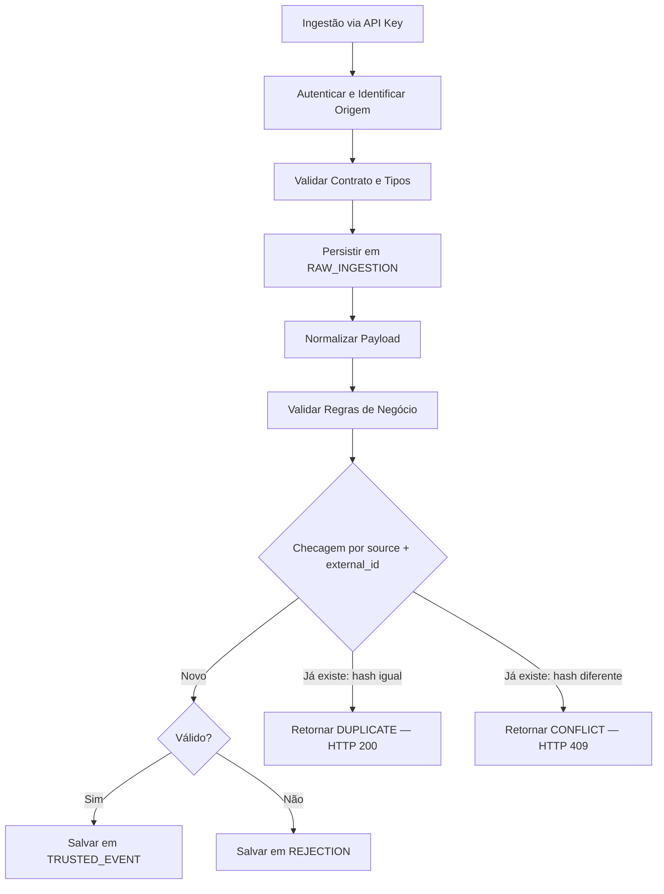

# Data Pipeline API

API RESTful para ingestão estruturada de eventos, com validação, deduplicação por identificador de origem, persistência relacional e registro de rejeições — suportada por um frontend administrativo de consulta.

**Status:** Deployado em produção (Render) / MVP funcional, em evolução ativa.

---

## Problema Resolvido

Aplicações frequentemente precisam receber dados de múltiplos parceiros e fontes externas. Isso gera problemas clássicos: dados mal formatados que quebram o banco, envios duplicados que sujam relatórios e falta de rastreabilidade sobre quem enviou o quê e quando.

Este projeto resolve esse cenário atuando como uma camada de proteção (gatekeeper). Ele garante que apenas dados validados cheguem às tabelas de negócio (`TRUSTED`), enquanto registra tudo o que entra (`RAW`) e isola dados inválidos em `REJECTIONS` para análise futura.

---

## Como Funciona



---

## Arquitetura

O sistema é construído sobre uma arquitetura monolítica modular, separando responsabilidades em camadas lógicas:

- **Camada de Transporte:** FastAPI (Uvicorn) gerenciando conexões HTTP, rate limiting (SlowAPI) e parsing JSON.
- **Camada de Autenticação/RBAC:** validação de API Keys (hash) para sistemas externos e JWT para usuários do dashboard.
- **Camada de Serviço:** orquestração do pipeline de ingestão e regras de negócio.
- **Camada de Dados:** SQLAlchemy e PostgreSQL, com Alembic controlando o versionamento de schema.
- **Frontend administrativo:** HTML/CSS/JS puro, consumindo a API pública via JWT, com telas de login, dashboard, Trusted, Rejections, Security Events e Audit Logs.

---

## Decisões de Arquitetura

**Idempotência forte via hash do payload (SHA-256):** cada evento é identificado por `(source, external_id)`. Se um evento com essa chave já existir, a API calcula o hash do payload recebido e compara com o hash armazenado. Hash igual → `DUPLICATE` (HTTP 200, reenvio inofensivo). Hash diferente → `CONFLICT` (HTTP 409, tentativa de alterar um evento já consolidado é rejeitada). A constraint de banco (`ck_raw_ingestion_processing_status`) valida os quatro status possíveis (`ACCEPTED`, `REJECTED`, `DUPLICATE`, `CONFLICT`) diretamente na tabela, garantindo que a trilha de auditoria em `RAW_INGESTION` reflita com precisão o que de fato aconteceu com cada evento — inclusive tentativas de sobrescrita.

**Isolamento RAW x TRUSTED:** todo evento, válido ou não, é salvo na tabela `RAW_INGESTION`. Isso garante rastreabilidade total de auditoria, mesmo que o sistema externo acuse um erro.

**Controle de Acesso Baseado em Papéis (RBAC):** os acessos administrativos são particionados por rota para minimizar a superfície de ataque:

| Recurso / Rota | admin | auditor | analyst | operator |
|---|---|---|---|---|
| Ingestão (`/ingest`) | Sim | Não | Não | Não |
| Trusted (`/events`) | Sim | Sim | Sim | Sim |
| Rejeições (`/rejections`) | Sim | Sim | Sim | Não |
| Métricas (`/metrics`) | Sim | Sim | Sim | Sim |
| RAW Evidência (`/raw`) | Sim | Sim | Não | Não |
| Auditoria (`/audit`) | Sim | Sim | Sim | Não |
| Security Events | Sim | Sim | Não | Não |
| Configuração de Usuários | Sim | Não | Não | Não |

> Tabela a conferir contra a implementação real de RBAC antes de publicar — validar papéis e permissões exatas no código antes de considerar definitivo.

**Segurança em profundidade no login:** além de RBAC e JWT, o endpoint de login tem rate limiting por IP via SlowAPI (`LOGIN_RATE_LIMIT`, ex. `5/minute`) e bloqueio temporário após 5 tentativas falhas consecutivas (retorna `429`). O login retorna dois tokens — `access_token` (curto) e `refresh_token` (longo) — renovável via `POST /api/v1/auth/refresh` sem exigir novo login. A API também adiciona headers de segurança (`Strict-Transport-Security`, `Content-Security-Policy`, `X-XSS-Protection`), com CSP mais permissiva nas rotas do Swagger para não quebrar a UI. Eventos de autenticação (`login_success`, `login_failed`, `login_blocked`, `token_refresh`) são logados de forma estruturada com IP, user agent, papel e rota.

**Observabilidade:** cada requisição propaga (ou gera, se ausente) um `X-Request-Id`, e a resposta inclui `X-Process-Time-Ms` com a latência do processamento. O endpoint `/metrics` expõe contadores básicos, e `/ready` valida tanto a API quanto a conexão com o banco antes de reportar saúde.

---

## Trade-offs

- **Armazenamento redundante:** salvar o dado puro em `RAW` e o normalizado em `TRUSTED` duplica o consumo de espaço para cada evento bem-sucedido. Optou-se por esse custo em prol de segurança e auditoria retroativa.
- **Ingestão síncrona:** validação e inserção no banco ocorrem no mesmo ciclo da requisição HTTP. Funciona bem para o volume atual, mas pode gargalar em cenários de alto throughput.
- **Uso de hash para API Keys:** armazenar apenas o hash das API Keys no banco protege as credenciais em caso de vazamento, mas impossibilita a recuperação da chave — se uma origem perder a chave, uma nova precisa ser gerada.

---

## Estrutura do Projeto

```text
data_pipeline_api/
├── app/
│   ├── api/          # Controladores (endpoints HTTP) e schemas Pydantic
│   ├── core/         # Configurações globais, segurança e rate limit
│   ├── infra/        # SQLAlchemy session, repositórios e models do banco
│   ├── scripts/      # Utilitários de bootstrapping e geradores
│   └── services/     # Regras de negócio do pipeline de dados
├── deploy/           # Configurações de infra (Nginx, Certbot, scripts)
├── docs/             # Diagramas e log de decisões de arquitetura
├── frontend/         # Dashboard vanilla HTML/JS/CSS
└── tests/            # Suite de testes de integração via Pytest
```

---

## Tecnologias

| Tecnologia | Papel |
|---|---|
| FastAPI | Framework base, roteamento assíncrono e validação OpenAPI |
| PostgreSQL | Persistência transacional dos dados RAW, TRUSTED e de usuários |
| SQLAlchemy / Alembic | ORM e controle de revisões (migrations) |
| Docker / Compose | Containerização e orquestração do ambiente local |
| JWT / Passlib | Autenticação stateless, refresh tokens e hash de credenciais |
| SlowAPI | Rate limiting para mitigar brute force no login |
| Pytest | Testes automatizados |

---

## Como Executar

### Ambiente publicado

O projeto está em produção no Render:

- **API:** `https://data-pipeline-api-p01y.onrender.com`
- **Frontend:** `https://data-pipeline-frontend.onrender.com`
- **Healthcheck:** `https://data-pipeline-api-p01y.onrender.com/api/v1/health`

### Rodando localmente

Pré-requisitos: Docker e Docker Compose.

```bash
cp .env.example .env
docker compose up -d --build
```

Confirme que a aplicação e o banco estão saudáveis:

```bash
curl -i http://localhost:8000/api/v1/ready
```

[PRINT: retorno JSON do endpoint /ready]

Acesse a documentação interativa em `http://localhost:8000/docs`.

[PRINT: Swagger UI exibindo os endpoints de Autenticação e Ingestão]

**Endpoints principais** (lista completa sempre no Swagger):

| Endpoint | Método | Descrição |
|---|---|---|
| `/api/v1/health` | GET | Healthcheck simples |
| `/api/v1/ready` | GET | Readiness (inclui checagem do banco) |
| `/api/v1/metrics` | GET | Contadores básicos |
| `/api/v1/ingest` | POST | Ingestão de eventos (API Key) |
| `/api/v1/auth/login` | POST | Login (retorna access + refresh token) |
| `/api/v1/auth/refresh` | POST | Renovação de access token |

### Variáveis de ambiente

```env
DATABASE_URL=postgresql+psycopg://appuser:apppass@db:5432/appdb
APP_ENV=local

JWT_SECRET=change-me
JWT_ALG=HS256
JWT_EXPIRES_MIN=60
```

> No Docker, o host do Postgres é `db` (nome do serviço).

### Bootstrap inicial (seed)

O projeto inclui um script de seed idempotente que garante a existência de um usuário admin e de uma fonte de dados de teste:

```bash
docker compose exec api python -m app.scripts.seed
```

Os valores vêm de variáveis de ambiente, com defaults apenas para desenvolvimento:

| Variável | Default (dev) | Uso |
|---|---|---|
| `SEED_ADMIN_USERNAME` | `admin` | Usuário administrador inicial |
| `SEED_ADMIN_PASSWORD` | `admin123` | Senha do admin (hash via Passlib) |
| `SEED_SOURCE_NAME` | `partner_a` | Nome da fonte de dados de teste |
| `SEED_SOURCE_API_KEY` | `partner_a_key_change_me` | API Key da fonte de teste (hash SHA-256) |

> **Produção:** essas quatro variáveis precisam ser sobrescritas com valores fortes e aleatórios. Os defaults acima são públicos (estão neste README) e não protegem nada se deixados como estão.

### Migrations (Alembic)

```bash
docker compose exec api sh -c "alembic upgrade head"
```

---

## Como Testar

```bash
docker compose exec -e PYTHONPATH=/app api pytest -q
```

Cobertura atual: rotas HTTP, validação de permissões (RBAC) e regras de negócio do banco.

**CI (GitHub Actions):** todo `push` e `pull_request` para `main` e `develop` dispara o workflow `.github/workflows/ci.yml`, que roda lint (`flake8 app`), aplica migrations (`alembic upgrade head`) e executa a suite de testes contra um PostgreSQL de serviço no runner — o mesmo cenário que os testes de integração da Fase 3 vão reaproveitar.

---

## Limitações Conhecidas

- **Gargalo monolítico:** a thread da API trava durante validação e escrita no banco, o que pode derrubar o rate limit sob rajadas massivas de dados concorrentes.
- **Sem expurgo de logs:** as tabelas `AUDIT_LOG` e `SECURITY_EVENT` não têm política de limpeza automática (ex.: exclusão de registros com mais de 90 dias), o que infla a base ao longo do tempo.
- **Frontend acoplado:** o ambiente de deploy atual expõe API e frontend quase como dependências simultâneas de infraestrutura, limitando atualizações da UI sem envolver a configuração do servidor.

---

## O que este projeto ainda NÃO faz

- Não utiliza mensageria assíncrona (Kafka, RabbitMQ, AWS SQS) para buffer de ingestão.
- Não integra com data lakes (S3/GCS) para arquivamento frio da tabela RAW — a responsabilidade inteira está no PostgreSQL relacional.
- Não envia notificações em tempo real (webhooks, Slack/Teams) quando um evento cai em rejeições.

---

## Próximos Passos

- Substituir a ingestão síncrona por uma fila (Redis), desacoplando a resposta HTTP (202 Accepted) do worker de inserção no banco.
- Implementar paginação otimizada nos endpoints de listagem (a paginação atual pode sofrer com offset lento em volumes grandes).
- Criar rotina de rotação/limpeza de logs antigos.

---

## Evolução para Produção

O projeto já possui arquitetura e deploy validados no Render. Além disso, o repositório já inclui um cenário alternativo de deploy próprio via Docker Compose + Nginx como reverse proxy (pasta `deploy/`), com healthchecks para estabilização do stack — útil caso o projeto precise sair do Render para uma VM própria. O bloco HTTPS do Nginx (Certbot) fica pronto para ativar quando houver um domínio público apontado.

Para uma evolução visando produção de escala maior, o roadmap prevê:

- Migração de infraestrutura gerenciada para AWS, separando banco (RDS) de API (ECS/Fargate).
- Réplicas Read-Only do PostgreSQL dedicadas às consultas do frontend administrativo, isolando essas queries dos recursos da máquina responsável pela ingestão.
- Logs estruturados (JSON) no stdout, agregados por ferramentas de observabilidade (Datadog/ELK) via o request id propagado.

---

## Aprendizados

- O desenho antecipado do modelo de ameaças revelou a necessidade de eventos de segurança monitorados separadamente de logs comuns, permitindo visualizar tentativas ativas de brute-force na API.
- O uso de fixtures e containers do Pytest melhorou a confiança nas alterações do ORM sem deixar o ambiente de desenvolvimento sujo com dados de teste.
- Alterar uma `CHECK constraint` via Alembic não é suficiente por si só: uma revision gerada duas vezes por engano, com o `upgrade()` vazio, ficou marcada como "aplicada" pelo Alembic sem mudar nada no banco. O sintoma (teste falhando com `CheckViolation`) só fez sentido depois de comparar a definição real da constraint no Postgres (`pg_get_constraintdef`) com o conteúdo do arquivo de migration — o `alembic current` sozinho não é suficiente pra confirmar que uma mudança de schema realmente aconteceu.

---

## Autor

**Robert Emanuel**
Back-end Developer (Python/FastAPI • SQL • Docker • Segurança)