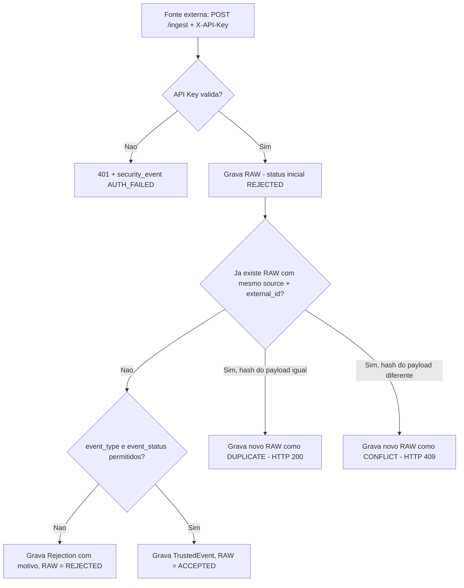

# Data Pipeline API — RAW → TRUSTED → REJECTIONS

API para ingestão de eventos de múltiplas fontes, com validação, deduplicação e detecção de conflito por hash, persistência relacional, rastreio de rejeições, autenticação em duas camadas (fontes via API Key, usuários via JWT), RBAC, auditoria e observabilidade básica.

**Status:** Deployado em produção (Render) — MVP funcional, com pipeline de ingestão, autenticação/RBAC, auditoria e suíte de testes automatizados. Pontos de configuração pendentes estão detalhados em "Trade-offs" e "Limitações Conhecidas".

---

## Problema Resolvido

Quando várias fontes (parceiros, sistemas internos, sensores) mandam eventos pra um mesmo lugar, o problema raramente é só "salvar o dado". É saber o que fazer quando o evento vem malformado, quando ele repete — ou quando repete com dados diferentes — e quem mexeu no quê depois.

Este projeto resolve isso com um pipeline de três estágios: todo evento entra como `RAW` (sempre gravado, mesmo que depois seja recusado), é validado e vira `TRUSTED` (dado confiável, consultável) ou `REJECTION` (com motivo e o payload original preservado). Reenvios do mesmo evento são identificados por hash do payload, distinguindo um reenvio inofensivo de uma tentativa de alterar um evento já consolidado. Por cima disso, autenticação por fonte, login com perfis de acesso e auditoria de qualquer alteração manual nos dados.

---

## Como Funciona



Do outro lado, operadores/analistas/auditores consultam TRUSTED, REJECTIONS, auditoria e eventos de segurança via um frontend administrativo, autenticados por JWT e restritos por papel.

---

## Arquitetura

- **`app/main.py`** — bootstrap da aplicação: registra middlewares (rate limit, security headers, request id, CORS), os handlers de erro e o router principal.
- **`app/api/router.py` + `app/api/routes/`** — uma rota por módulo (`auth`, `ingest`, `trusted`, `rejections`, `audit`, `security_events`, `metrics`, `health`, `ready`). Cada rota só orquestra: valida entrada, chama a camada de baixo, formata a saída.
- **`app/api/deps.py`** — as duas formas de autenticação (API Key por fonte, JWT por usuário) e o RBAC (`require_roles`), usados como dependências do FastAPI.
- **`app/domain/validation.py`** — regra de negócio de validação: `event_type` e `event_status` precisam estar em listas fechadas de valores permitidos.
- **`app/services/ingest_service.py`** — orquestra o pipeline inteiro: grava RAW, checa duplicidade/conflito por hash, valida, decide entre TRUSTED e REJECTION.
- **`app/infra/db/`** — `models` (SQLAlchemy), `repositories` (uma função por operação de acesso a dado, sem lógica de negócio) e `migrations` (Alembic).
- **`app/core/`** — configuração (`settings.py`), segurança (`security.py`), logging estruturado, rate limit, bloqueio de brute-force, métricas HTTP em memória e os middlewares de request-id/security-headers.
- **`app/scripts/seed.py`** — cria o usuário admin e a fonte iniciais, de forma idempotente.
- **`frontend/`** — painel administrativo estático (HTML/CSS/JS puro), com login e telas de consulta.

---

## Decisões de Arquitetura

**RAW sempre gravado primeiro, com status pessimista.** Todo evento que chega vira uma linha em `raw_ingestion` antes de qualquer validação, já marcado como `REJECTED` por padrão. Garante que nenhum dado bruto se perde, mesmo que a validação falhe logo depois.

**Idempotência forte via hash do payload (SHA-256).** Cada evento é identificado por `(source, external_id)`. Se já existir um evento com essa chave, a API compara o hash do payload recebido com o hash armazenado: hash igual → `DUPLICATE` (HTTP 200, reenvio inofensivo, não reprocessa); hash diferente → `CONFLICT` (HTTP 409, a tentativa de alterar um evento já consolidado é rejeitada, não sobrescrita silenciosamente). A constraint de banco (`ck_raw_ingestion_processing_status`) valida os quatro status possíveis (`ACCEPTED`, `REJECTED`, `DUPLICATE`, `CONFLICT`) diretamente na tabela, garantindo que a trilha de auditoria em `RAW_INGESTION` reflita com precisão o que aconteceu com cada evento — inclusive tentativas de sobrescrita.

**Hash de API Key com SHA-256 + `hmac.compare_digest`, e não bcrypt/argon2.** Fontes autenticam no `/ingest` com uma API Key (header `X-API-Key`) comparada via hash contra o valor salvo no banco — a chave em texto puro nunca é persistida. A escolha de um hash rápido (em vez de bcrypt/passlib, usado para senha) parte da premissa de que a chave é gerada com alta entropia (`secrets.token_urlsafe(32)`); um hash rápido comparado em tempo constante já é suficiente para uma chave assim. Essa premissa só vale se a chave em uso for gerada dessa forma — o script de seed usa um valor de exemplo (`SEED_SOURCE_API_KEY`) só para desenvolvimento local; fontes reais em produção precisam de uma chave gerada com entropia real, não o default do seed.

**Dois tokens (access curto + refresh longo).** Login retorna `access_token` e `refresh_token`; `POST /auth/refresh` troca o refresh por um novo access token. Evita forçar login a cada hora sem manter a sessão indefinidamente válida.

**RBAC com quatro papéis** (`admin`, `analyst`, `operator`, `auditor`), aplicado por rota:

| Rota | Papéis permitidos |
|---|---|
| `GET /trusted` | operator, analyst, admin |
| `PATCH /trusted/{id}` | admin |
| `GET /rejections` | analyst, admin |
| `GET /audit` | auditor, admin |
| `GET /security-events` | auditor, admin |
| `GET /metrics` | operator, analyst, admin |

**Segurança em profundidade no login:** rate limiting (SlowAPI, `LOGIN_RATE_LIMIT`) e bloqueio por tentativas (5 falhas seguidas → bloqueio temporário por IP, HTTP 429). Headers de segurança adicionais (`Strict-Transport-Security`, `Content-Security-Policy`, `X-XSS-Protection`), com CSP mais permissiva nas rotas do Swagger. Eventos de autenticação (`login_success`, `login_failed`, `login_blocked`, `token_refresh`) são logados de forma estruturada.

**Auditoria separada de security events, por finalidade diferente.** Qualquer `PATCH` em `/trusted` exige um campo `reason` e grava snapshot de antes/depois — é trilha de mudança de dado. Tentativas de autenticação inválidas e acessos negados geram um registro à parte, pensado para investigação de segurança, não para rastreio de alteração.

**Observabilidade:** `X-Request-Id` (aceita o valor enviado pelo cliente ou gera um novo, propagado em todo o ciclo da requisição) e `X-Process-Time-Ms` em toda resposta. Logging estruturado com `request_id`, `client_ip`, `user_id` e `role` em cada linha. `GET /metrics` combina agregados do banco (contagem por status, top fontes) com contadores HTTP em memória. `GET /ready` faz um `SELECT 1` real no banco e devolve 503 se o Postgres estiver fora do ar.

**Chave de rate-limit/brute-force configurável via header `X-Client-IP`.** Pensada originalmente para facilitar testes automatizados e simular estar atrás de um proxy sem precisar simular conexões TCP reais. O custo dessa flexibilidade está detalhado em "Trade-offs".

**Bootstrap via script (`seed.py`), não via endpoint.** Como não existe tela de "criar admin", o primeiro usuário e a primeira fonte nascem de um script idempotente, disparado automaticamente no `CMD` do Dockerfile a cada subida do container.

**Nginx com bloco HTTPS comentado.** Deixado pronto para ativar quando houver domínio e certificado, em vez de forçar HTTPS num ambiente que ainda não tem os dois.

---

## Trade-offs

**Estado operacional em memória do processo.** Os contadores usados em `/metrics` (`app/core/http_metrics.py`) e o bloqueio de brute-force (`app/core/login_attempts.py`) vivem em dicionários dentro do processo Python, protegidos por lock. Funciona bem com uma única réplica; com múltiplos workers ou instâncias, cada processo tem sua própria contagem — um atacante distribuído entre processos nunca acumula tentativas no mesmo contador, e `/metrics` só reflete o processo que atendeu aquela chamada específica.

**Identificação de IP inconsistente entre módulos, e desalinhada com o Nginx do próprio repositório.** A ingestão usa `request.client.host` puro. Login e rate-limit aceitam um header `X-Client-IP` enviado pelo cliente, documentado como recurso para testes/proxy. O `nginx/default.conf` deste projeto, porém, define `X-Real-IP` e `X-Forwarded-For` — nunca `X-Client-IP`. Ou seja, atrás do Nginx documentado aqui, esse header nunca é preenchido pelo proxy e fica sob controle total de quem faz a chamada.

**`SEED_ON_STARTUP` não é lido em nenhum lugar.** A variável existe em `settings.py`, mas quem decide se o seed roda é o `CMD` do Dockerfile, que chama `python -m app.scripts.seed` incondicionalmente a cada subida. Na prática, isso significa que a senha do admin seed e a API Key da fonte seed voltam para o valor das variáveis de ambiente a cada restart do container, mesmo que alguém tenha alterado esses valores direto no banco depois.

**Armazenamento redundante (RAW + TRUSTED).** Salvar o dado puro em `RAW` e o normalizado em `TRUSTED` duplica o consumo de espaço para cada evento bem-sucedido. Optou-se por esse custo em prol de segurança e auditoria retroativa.

---

## Estrutura do Projeto

```text
data_pipeline_api/
├── Dockerfile
├── docker-compose.yml
├── docker-compose.prod.yml
├── alembic.ini
├── requirements.txt
├── .env.example / .env.prod.example
├── app/
│   ├── main.py
│   ├── api/
│   │   ├── router.py
│   │   ├── deps.py                 # API Key, JWT, RBAC
│   │   ├── routes/                  # auth, ingest, trusted, rejections, audit, security_events, metrics, health, ready
│   │   └── schemas/                 # DTOs Pydantic por módulo
│   ├── domain/
│   │   └── validation.py            # regra de negócio: event_type/event_status
│   ├── services/
│   │   └── ingest_service.py        # orquestra RAW → dedup/conflito por hash → validação → TRUSTED/REJECTION
│   ├── core/
│   │   ├── settings.py, security.py, logging.py
│   │   ├── rate_limit.py, login_attempts.py, http_metrics.py
│   │   └── middleware/              # request_id, security_headers
│   ├── infra/db/
│   │   ├── models/                   # SQLAlchemy
│   │   ├── repositories/             # acesso a dado por entidade
│   │   └── migrations/               # Alembic
│   └── scripts/
│       └── seed.py                   # cria admin + source iniciais
├── tests/                             # suíte de integração contra Postgres real
├── frontend/                          # painel admin estático (HTML/CSS/JS)
├── deploy/
│   ├── nginx/default.conf
│   ├── certbot/
│   └── scripts/                       # deploy.sh, rollback.sh
└── docs/
    ├── fases/, overview/, ops/         # documentação do desenvolvimento por fase
    └── diagramas/
```

---

## Tecnologias

| Tecnologia | Papel no projeto |
|---|---|
| FastAPI + Uvicorn | Expõe a API e roda o servidor ASGI |
| SQLAlchemy + psycopg | ORM e driver de acesso ao PostgreSQL |
| Alembic | Versionamento do schema |
| python-jose | Emissão e validação dos JWTs |
| passlib (pbkdf2_sha256) | Hash de senha dos usuários |
| slowapi | Rate limiting do endpoint de login |
| pytest + httpx | Suíte de testes contra a API real |
| Docker + Docker Compose | Empacotamento e orquestração local/produção |
| Nginx | Reverse proxy em produção, com TLS via Certbot |
| PostgreSQL | Banco relacional (RAW, TRUSTED, REJECTIONS, auditoria) |
| Render | Hospedagem da API, do banco e do frontend |

> `pydantic-settings` está listado no `requirements.txt`, mas `app/core/settings.py` usa `os.getenv` puro por decisão explícita registrada no próprio arquivo — a dependência está instalada, mas não é usada hoje.

---

## Como Executar

### Ambiente publicado

- **API:** `https://data-pipeline-api-p01y.onrender.com`
- **Frontend:** `https://data-pipeline-frontend.onrender.com`
- **Healthcheck:** `https://data-pipeline-api-p01y.onrender.com/api/v1/health`

### Rodando localmente

Pré-requisitos: Docker e Docker Compose.

```bash
cp .env.example .env
docker compose up -d --build
```

O `CMD` do Dockerfile já aplica as migrations e roda o seed (`alembic upgrade head && python -m app.scripts.seed`) automaticamente antes de subir o Uvicorn.

```bash
curl -i http://localhost:8000/api/v1/health
curl -i http://localhost:8000/api/v1/ready
```

Swagger em `http://localhost:8000/docs`.

**Endpoints principais** (lista completa sempre no Swagger):

| Endpoint | Método | Descrição |
|---|---|---|
| `/api/v1/health` | GET | Healthcheck simples |
| `/api/v1/ready` | GET | Readiness (inclui checagem do banco) |
| `/api/v1/metrics` | GET | Contadores agregados |
| `/api/v1/ingest` | POST | Ingestão de eventos (API Key) |
| `/api/v1/auth/login` | POST | Login (retorna access + refresh token) |
| `/api/v1/auth/refresh` | POST | Renovação de access token |

### Bootstrap inicial (seed)

O seed cria um admin e uma fonte de teste, a partir de variáveis de ambiente com defaults de desenvolvimento:

| Variável | Default (dev) | Uso |
|---|---|---|
| `SEED_ADMIN_USERNAME` | `admin` | Usuário administrador inicial |
| `SEED_ADMIN_PASSWORD` | `admin123` | Senha do admin (hash via Passlib) |
| `SEED_SOURCE_NAME` | `partner_a` | Nome da fonte de dados de teste |
| `SEED_SOURCE_API_KEY` | `partner_a_key_change_me` | API Key da fonte de teste (hash SHA-256) |

> **Produção:** essas quatro variáveis precisam ser sobrescritas com valores fortes e aleatórios — e permanecer assim, já que o seed roda a cada restart do container (ver "Trade-offs" sobre `SEED_ON_STARTUP`).

### Login e ingestão de teste

```bash
curl -X POST http://localhost:8000/api/v1/auth/login \
  -H "Content-Type: application/json" \
  -d '{"username":"admin","password":"admin123"}'
```

```bash
curl -X POST http://localhost:8000/api/v1/ingest \
  -H "X-API-Key: partner_a_key_change_me" \
  -H "Content-Type: application/json" \
  -d '{
    "source": "partner_a",
    "external_id": "evt-001",
    "entity_id": "ent-1",
    "event_type": "ORDER",
    "event_status": "NEW",
    "event_timestamp": "2026-07-14T12:00:00Z",
    "attributes": {}
  }'
```

### Migrations (Alembic)

```bash
docker compose exec api sh -c "alembic upgrade head"
docker compose exec api alembic revision -m "mensagem"
```

### Frontend

HTML/CSS/JS puro, sem build. `frontend/config.js` tem `API_BASE_URL` fixo apontando para o backend em produção no Render — para testar contra a API local, troque esse valor para `http://localhost:8000` antes de servir os arquivos estáticos.

---

## Como Testar

```bash
docker compose exec -e PYTHONPATH=/app api pytest -q
```

A suíte roda contra um Postgres real (não mocks), usando `SAVEPOINT`/rollback por teste (`tests/conftest.py`) para isolar cada caso sem sujar o banco. Cobre autenticação (login, refresh, brute-force), RBAC, ingestão (RAW/TRUSTED/REJECTION, deduplicação e conflito por hash), auditoria, readiness e formato padronizado de erro HTTP.

**CI (GitHub Actions):** todo `push` e `pull_request` para `main` e `develop` dispara o workflow `.github/workflows/ci.yml`, que roda lint (`flake8 app`), aplica migrations e executa a suíte de testes contra um PostgreSQL de serviço no runner.

---

## Limitações Conhecidas

- `SEED_ON_STARTUP` nunca é lido; o seed roda incondicionalmente a cada subida do container, via `CMD` do Dockerfile.
- `LOGIN_MAX_ATTEMPTS` e `LOGIN_BLOCK_MINUTES` existem em `settings.py`, mas nunca são lidos — os valores reais (5 tentativas, 10 minutos) estão fixos em `login_attempts.py`.
- `X-Client-IP` é aceito de headers enviados pelo próprio cliente para a chave de rate-limit/brute-force, mas o Nginx do projeto não seta esse header — atrás do proxy documentado aqui, ele fica sob controle de quem faz a chamada.
- Contadores de `/metrics` e bloqueio de brute-force vivem em memória do processo; não sobrevivem a um restart nem são compartilhados entre réplicas.
- `GET /metrics` chama `get_metrics()` duas vezes seguidas com os mesmos parâmetros — uma consulta redundante ao banco.
- `frontend/config.js` tem a URL da API fixa no código, apontando para produção por padrão.
- Bloco HTTPS do Nginx está comentado, sem certificado ativo por padrão.
- Gargalo monolítico: a thread da API trava durante validação e escrita no banco, o que pode derrubar o rate limit sob rajadas massivas de dados concorrentes.
- Tabelas `AUDIT_LOG` e `SECURITY_EVENT` não têm política de expurgo automático.

---

## O que este projeto ainda NÃO faz

- Não faz upsert de eventos: um reenvio com o mesmo identificador mas payload diferente é bloqueado como `CONFLICT`, não aplicado como atualização.
- Não tem revogação/blacklist de refresh token: um token emitido continua válido até expirar, mesmo sem endpoint de logout.
- Não persiste métricas HTTP nem estado de brute-force em Redis ou banco — está tudo em memória de processo.
- Não expõe métricas em formato Prometheus, só um JSON próprio.
- Não tem HTTPS habilitado por padrão.
- Não tem endpoint de criação de usuário fora do script de seed.
- Não utiliza mensageria assíncrona (Kafka, RabbitMQ, AWS SQS) para buffer de ingestão.
- Não integra com data lakes (S3/GCS) para arquivamento frio da tabela RAW.

---

## Próximos Passos

- Fazer o Dockerfile/entrypoint respeitar `SEED_ON_STARTUP` de fato, permitindo desligar o seed automático depois do primeiro deploy.
- Mover contadores de métricas HTTP e bloqueio de brute-force para Redis, para funcionar corretamente com múltiplas réplicas.
- Alinhar o header de IP confiável entre o Nginx (`X-Real-IP`/`X-Forwarded-For`) e o código (hoje `X-Client-IP`).
- Remover a chamada duplicada em `GET /metrics`.
- Adicionar endpoint de logout/revogação de refresh token.
- Implementar paginação otimizada nos endpoints de listagem.
- Criar rotina de rotação/limpeza de logs antigos.

---

## Evolução para Produção

- **Redis** para estado compartilhado entre réplicas (rate limit, brute-force, métricas HTTP).
- **Prometheus + Grafana**, no lugar do JSON próprio em `/metrics`.
- **HTTPS ativo** via Certbot, assim que houver domínio definitivo.
- **Fila** para dissociar ingestões de alto volume da resposta síncrona do `/ingest`.
- **Revogação de refresh tokens** (tabela de tokens ativos ou denylist).
- **Alertas automáticos** a partir dos `security_events` (ex.: N tentativas de login bloqueadas em um intervalo curto).
- Migração de infraestrutura gerenciada para AWS, separando banco (RDS) de API (ECS/Fargate), com réplicas Read-Only para consultas do frontend.

---

## Aprendizados

- Rever o próprio `ingest_service.py` revelou que o `payload_hash` era calculado desde o início mas nunca usado na decisão de deduplicação — dead code disfarçado de feature. Essa correção virou a idempotência real (`DUPLICATE` vs `CONFLICT`) implementada na v1.1.0.
- Alterar uma `CHECK constraint` via Alembic não é suficiente por si só: uma revision gerada duas vezes por engano, com o `upgrade()` vazio, ficou marcada como "aplicada" pelo Alembic sem mudar nada no banco. O sintoma só fez sentido depois de comparar a definição real da constraint no Postgres (`pg_get_constraintdef`) com o conteúdo do arquivo de migration — `alembic current` sozinho não confirma que uma mudança de schema realmente aconteceu.
- Só percebi nesta revisão que `SEED_ON_STARTUP` nunca é lido — a variável ficou no `settings.py` de uma fase mais antiga, enquanto o comportamento real foi definido direto no `CMD` do Dockerfile, e as duas coisas foram divergindo sem eu notar.
- Entender a diferença entre `X-Real-IP`/`X-Forwarded-For` (que o Nginx injeta de verdade) e `X-Client-IP` (que o código espera) ensinou a sempre validar, depois de configurar um proxy, se o cabeçalho que o código lê é exatamente o que o proxy envia.
- Rodar os testes com `SAVEPOINT` contra um Postgres real, em vez de mockar o banco, deu mais confiança de que os testes refletem o comportamento real da aplicação — ao custo de precisar de um Postgres de pé para rodar a suíte.
- Separar auditoria (mudança em dado) de security events (tentativa de acesso) desde o início evitou misturar duas coisas com finalidades diferentes no mesmo log.

---

## Autor

**Robert Emanuel**

Desenvolvedor Back-end focado em Python, FastAPI, SQL, Docker e APIs REST.

GitHub: https://github.com/r0b3rTdk
LinkedIn: https://www.linkedin.com/in/robert-emanuel/